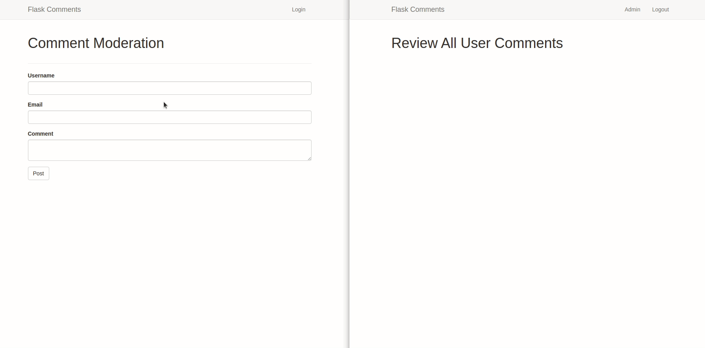

# Comment Moderation in a Flask Application

One of the challenges that administrators if an application have is the control of the comments that users post. Being able moderate users comments is a very important feature of a website. This application shows how you can create a custom comment moderation feature in a Flask application.



## Features

- Comment Moderation
- User Management
- Database Management

## Tools Used

- Flask framework
- Flask Bootstrap (CSS framework)
- Flask-WTF (Forms)
- Flask-SQLAlchemy (Database)
- Flask-Login (User Authentication)
- Flask-Migrate (Database Migration)
- Email Validator (Email Validation)
- Python for programming

## Testing

1. Clone this repo:

```python
git clone git@github.com:GitauHarrison/user-comment-moderation-in-flask.git`
```

2. Change directory to the new repo:

```python
cd user-comment-moderation-in-flask
```

3. Create and activate a virtual environment:

```python
$ mkvirtualenv comment_moderation
```

4. Install dependencies:

```python
(comment_moderation)$ pip install -r requirements.txt
```

5. Run the server:

```python
(comment_moderation)$ flask run
```

## Learn 

Flask is very unopinionated. You can pretty much build whatever feature you want. If you would like to know how I was able to integrate comment moderation into this application, check out the  tutorial below:

- [Comment Moderation in Flask](https://github.com/GitauHarrison/notes/blob/master/comment_moderation.md)
